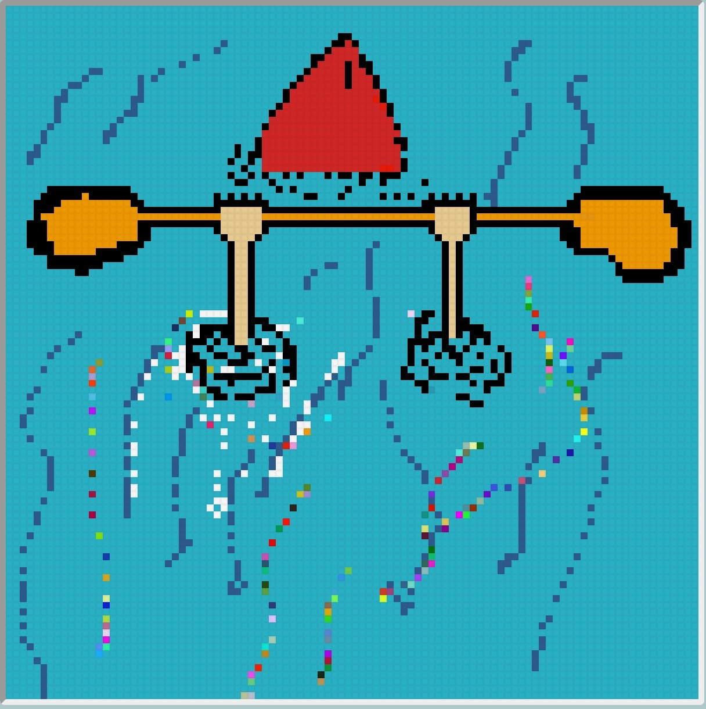

# Pixel Sketch

This is an app created with HTML, CSS, and vanilla JavaScript to draw pixel art.

This app features
- Change pen color or background color
- Eraser toggle
- A shading toggle that darkens whatever square you click or drag over by 10%
- A lighten toggle that does the inverse of the shading toggle
- A rainbow toggle to draw a random color on every square
- Toggle grid lines on or off
- Change the grid size from 1x1 up to 100x100

[Live Demo](https://evan1mclean.github.io/pixel-sketch/)

Some pictures below done on the app by my family :)

Self portrait of my brother

My dad's classic kayaking cartoon "Mystery Move"

Self portrait of my mom
